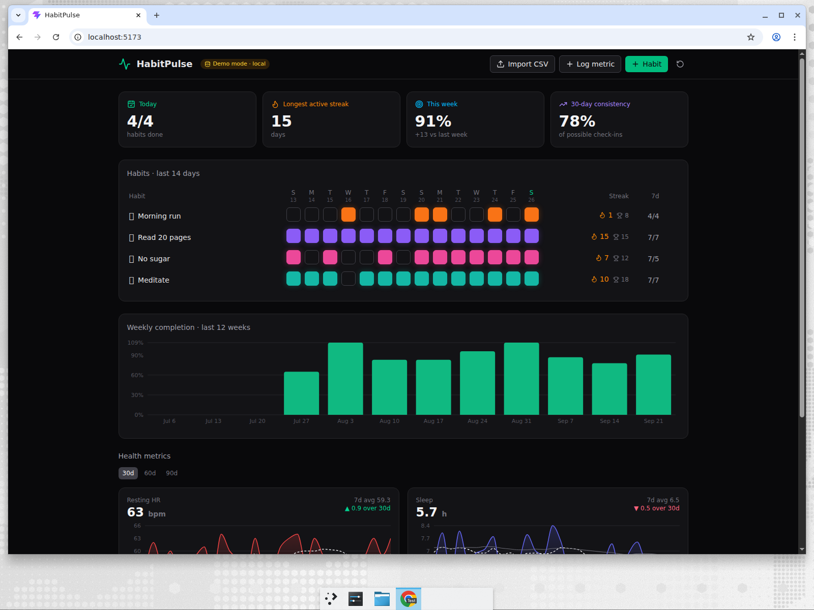

# HabitPulse

Personal habit & health dashboard built on **Supabase + React**.
Track daily habits, log health metrics (or import them from CSV / Strava), and let Postgres do the analytics: streaks, rolling averages and weekly completion are all computed in SQL views with window functions.



## What it shows off (Supabase-wise)

| Feature | Where |
|---|---|
| **Postgres window functions** – gaps-and-islands streaks, 7d/30d rolling averages, `lag()` deltas | `supabase/migrations/0001_init.sql` → `habit_streaks`, `metric_trends`, `weekly_completion` views |
| **Row Level Security** – every table scoped to `auth.uid()`, views use `security_invoker` so RLS applies through them | same file |
| **RPCs (Postgres functions)** – `toggle_habit_log`, `import_metric_entries(jsonb)` bulk upsert | same file |
| **Realtime** – `habit_logs` / `metric_entries` streamed so multiple tabs/devices stay in sync | `src/lib/supabaseRepo.ts` |
| **Auth** – email + password | `src/components/AuthGate.tsx` |
| **Auto-generated REST API** – the frontend just reads views with `supabase-js` | `src/lib/supabaseRepo.ts` |

The app also runs fully offline in **demo mode** (localStorage, seeded data) when no Supabase keys are configured, so you can demo the UI without a backend.

## Run it

```bash
npm install
npm run dev          # demo mode, http://localhost:5173
```

### Connect to Supabase

1. Create a project at https://supabase.com/dashboard.
2. Open **SQL Editor**, paste `supabase/migrations/0001_init.sql`, run it.
   (Or with the CLI: `supabase link --project-ref <ref> && supabase db push`.)
3. Copy `.env.example` → `.env` and fill in `VITE_SUPABASE_URL` and `VITE_SUPABASE_ANON_KEY` from **Project Settings → API**.
4. `npm run dev`, create an account, start checking things off.

For a hackathon demo, disable "Confirm email" under **Authentication → Providers → Email** so sign-up is instant.

## CSV import

Click **Import CSV**. Three formats are detected automatically (samples in `samples/`):

```csv
# wide – one column per metric
date,steps,sleep_hours,weight_kg
2026-09-01,8231,7.2,76.4

# long
date,key,value,label,unit
2026-09-01,water_l,2.1,Water,L

# Strava activities.csv export (aggregated per day → distance_km, active_minutes, elevation_m)
```

## Project layout

```
supabase/migrations/0001_init.sql   schema, RLS, views, RPCs, realtime publication
src/lib/types.ts                    Repo interface + row types
src/lib/supabaseRepo.ts             Supabase implementation
src/lib/localRepo.ts                localStorage demo implementation
src/lib/stats.ts                    JS mirrors of the SQL views (demo mode only)
src/lib/csv.ts                      CSV / Strava parsing
src/components/                     HabitGrid, StatCards, Charts, Dialogs, AuthGate
```

## Ideas to extend

- Edge Function cron that emails a weekly recap (`weekly_completion` is ready for it)
- Apple Health XML import via an Edge Function
- Public share link for a single habit (RLS policy on a `share_token`)
- pgvector over journal notes on `habit_logs.note`

## Stack

Vite · React 19 · TypeScript · Tailwind v4 · Recharts · date-fns · PapaParse · supabase-js
